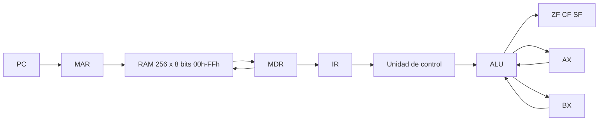

# Simulador de CPU von Neumann de 8 bits

Simulador en Excel con macros VBA del primer parcial de Arquitectura de Computadoras (SIS-131), Universidad Católica Boliviana San Pablo. Modela una CPU de 8 bits y una RAM de 256 bytes. Cada **STEP** ejecuta una fase del ciclo: Fetch, Decode, Execute o Store.

## Cómo abrirlo

1. Abre `simulador-cpu.xlsm`.
2. Habilita las macros. Si el archivo llegó bloqueado: clic derecho, Propiedades, Desbloquear.
3. Trabaja en la hoja **CPU**. La hoja **RAM** guarda el byte de cada casilla (fila 1 = dirección 0). La hoja **Inspección** lista las 256 casillas en hexadecimal, binario y decimal.

## Arquitectura



Una sola memoria guarda el programa (`00h`–`7Fh`) y los datos (`80h`–`FFh`). El CPU no escribe la RAM por su cuenta: solo `ReadRAM` y `WriteRAM`.

### Ciclo de instrucción

1. **Fetch.** `PC → MAR`, `ReadRAM → MDR → IR`, y el PC avanza el tamaño de la instrucción.
2. **Decode.** La unidad de control lee el opcode del IR y prepara los operandos.
3. **Execute.** La ALU opera, o se decide un salto, y se actualizan las banderas.
4. **Store.** El resultado se escribe en AX, en BX o en la RAM. `CMP` no escribe. `HLT` detiene el reloj.

## Manual

1. Pulsa **LOAD FIBO** o **LOAD 5+3** (`a = 5`, `b = 3`, `c = a + b`).
2. **STEP** avanza una fase. Cuatro clics completan una instrucción. La fase encendida y la columna **Estado** marcan el registro activo. La celda amarilla del mapa es la casilla en uso.
3. El mnemónico (por ejemplo `LOAD AX,[0x80]`) aparece en **Celda seleccionada**.
4. **RUN** sigue solo. **PAUSE** congela el reloj. El retardo está en **Delay (ms)**.
5. **RESET** pone PC, IR, MAR, MDR, AX, BX y las banderas en cero, apaga **ACTIVO** y vacía el log. No borra la RAM.
6. **HLT** detiene STEP y RUN. Para seguir, carga un programa o pulsa RESET.
7. El log muestra lo más reciente arriba, con la forma `[Paso NN] FASE: detalle`.

## ISA

El byte de registro vale `00` para AX y `01` para BX.

| Mnemónico | Opcode | Bytes | Operandos | Descripción | Flags |
|-----------|--------|-------|-----------|-------------|-------|
| `HLT` | `00` | 1 | — | Detiene el reloj | — |
| `MOV r, imm` | `01` | 3 | reg, imm8 | Copia el inmediato al registro | — |
| `MOV r, r` | `02` | 3 | reg, reg | Copia un registro a otro | — |
| `LOAD r, [dir]` | `03` | 3 | reg, dir8 | Lee la RAM hacia el registro | — |
| `STORE [dir], r` | `04` | 3 | dir8, reg | Escribe el registro en la RAM | — |
| `ADD r, imm` | `10` | 3 | reg, imm8 | Suma un inmediato | ZF, CF, SF |
| `ADD r, r` | `11` | 3 | reg, reg | Suma un registro | ZF, CF, SF |
| `SUB r, imm` | `12` | 3 | reg, imm8 | Resta un inmediato | ZF, CF, SF |
| `SUB r, r` | `13` | 3 | reg, reg | Resta un registro | ZF, CF, SF |
| `INC r` | `14` | 2 | reg | Incrementa | ZF, CF, SF |
| `DEC r` | `15` | 2 | reg | Decrementa | ZF, CF, SF |
| `CMP r, imm` | `16` | 3 | reg, imm8 | Resta sin guardar el resultado | ZF, CF, SF |
| `CMP r, r` | `17` | 3 | reg, reg | Resta sin guardar el resultado | ZF, CF, SF |
| `AND r, r` | `18` | 3 | reg, reg | AND bit a bit | ZF, SF (CF = 0) |
| `OR r, r` | `19` | 3 | reg, reg | OR bit a bit | ZF, SF (CF = 0) |
| `XOR r, r` | `1A` | 3 | reg, reg | XOR bit a bit | ZF, SF (CF = 0) |
| `NOT r` | `1B` | 2 | reg | NOT bit a bit | ZF, SF (CF = 0) |
| `JMP dir` | `20` | 2 | dir8 | PC = dir | — |
| `JZ dir` | `21` | 2 | dir8 | Salta si ZF = 1 | — |
| `JNZ dir` | `22` | 2 | dir8 | Salta si ZF = 0 | — |
| `JC dir` | `23` | 2 | dir8 | Salta si CF = 1 | — |

**ZF** vale 1 si el resultado es 0. **CF** vale 1 si hubo acarreo o préstamo fuera de 8 bits. **SF** es el bit 7 del resultado.

## Programa Fibonacci

Código en `00h`–`13h`. Datos: `80h` = a, `81h` = b. Arranque: a = 0, b = 1.

```
00  LOAD AX,[0x80]
03  LOAD BX,[0x81]
06  ADD  AX,BX
09  JC   0x13
0B  STORE [0x80],BX
0E  STORE [0x81],AX
11  JMP  0x00
13  HLT
```

Bytes: `03 00 80 03 01 81 11 00 01 23 13 04 01 80 04 00 81 20 00 00`.

Primera vuelta, después de Store de cada instrucción:

| Instrucción | PC | IR | AX | BX | ZF | CF | SF | Memoria |
|-------------|----|----|----|----|----|----|----|---------|
| inicio | 00 | — | 0 | 0 | 0 | 0 | 0 | 80h = 0, 81h = 1 |
| `LOAD AX,[0x80]` | 03 | 03 | 0 | 0 | 0 | 0 | 0 | igual |
| `LOAD BX,[0x81]` | 06 | 03 | 0 | 1 | 0 | 0 | 0 | igual |
| `ADD AX,BX` | 09 | 11 | 1 | 1 | 0 | 0 | 0 | igual |
| `JC 0x13` | 0B | 23 | 1 | 1 | 0 | 0 | 0 | CF = 0, no salta |
| `STORE [0x80],BX` | 0E | 04 | 1 | 1 | 0 | 0 | 0 | 80h = 1 |
| `STORE [0x81],AX` | 11 | 04 | 1 | 1 | 0 | 0 | 0 | 81h = 1 |
| `JMP 0x00` | 00 | 20 | 1 | 1 | 0 | 0 | 0 | vuelve al inicio |

La serie sigue hasta guardar 144 y 233. La suma siguiente es 144 + 233 = 377. No cabe en 8 bits: AX queda 121, CF = 1. `JC 0x13` salta y `HLT` detiene el reloj. Las casillas quedan en 144 y 233.

| Momento | PC | IR | AX | BX | ZF | CF | SF |
|---------|----|----|----|----|----|----|----|
| `ADD` de 144 + 233, tras Store | 09 | 11 | 121 | 233 | 0 | 1 | 0 |
| `JC 0x13` tomado | 13 | 23 | 121 | 233 | 0 | 1 | 0 |
| `HLT` | 14 | 00 | 121 | 233 | 0 | 1 | 0 |

## Archivos

| Archivo | Contenido |
|---------|-----------|
| `simulador-cpu.xlsm` | Libro: hojas CPU, RAM e Inspección |
| `CPU.bas` | Registros, ALU y banderas |
| `UI.bas` | Escritura de la hoja CPU |
| `Ciclo.bas` | Fases, carga de programas, RUN, PAUSE y RESET |
| `MemoriaRAM.bas` | `ReadRAM` y `WriteRAM` |
| `ThisWorkbook.cls` | Protección de las hojas al abrir |
| `README.md` | Este documento |
