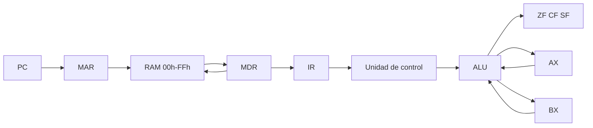

# Simulador de CPU von Neumann de 8 bits

Proyecto del primer parcial de **Arquitectura de Computadoras (SIS-131)**. Excel con macros VBA (`.xlsm`) que muestra el ciclo de instrucción y una RAM de 256 bytes.

## Arquitectura



Una sola memoria guarda código (`00h`–`7Fh`) y datos (`80h`–`FFh`). El CPU no escribe la RAM directo: solo `ReadRAM` y `WriteRAM`.

## Cómo usarlo

1. Abre `simulador-cpu.xlsm` y habilita macros.
2. Hoja **CPU**: botones de reloj y programas. Hoja **Memoria**: cuadrícula 16×16.
3. Pulsa **CARGAR FIBO** (programa obligatorio) o **CARGAR 5+3** (ejemplo de las diapositivas).
4. **STEP** avanza una fase: Fetch → Decode → Execute → Store.
5. **RUN** sigue solo. **PAUSE** congela. El retardo está en la celda **B23** (250 ms va bien en la defensa).
6. **RESET** pone registros y PC en cero. No borra la memoria.

Si Excel bloquea las macros: clic derecho en el archivo → Propiedades → Desbloquear.

## ISA

| Mnemónico | Opcode | Bytes | Qué hace | Flags |
|-----------|--------|-------|----------|-------|
| `HLT` | `00` | 1 | Detiene el reloj | — |
| `MOV r, imm` | `01` | 3 | Copia el inmediato al registro | — |
| `MOV r, r` | `02` | 3 | Copia un registro a otro | — |
| `LOAD r, [dir]` | `03` | 3 | Lee RAM hacia el registro | — |
| `STORE [dir], r` | `04` | 3 | Escribe el registro en RAM | — |
| `ADD r, imm` | `10` | 3 | Suma inmediato | ZF, CF, SF |
| `ADD r, r` | `11` | 3 | Suma registro | ZF, CF, SF |
| `SUB r, imm` | `12` | 3 | Resta inmediato | ZF, CF, SF |
| `SUB r, r` | `13` | 3 | Resta registro | ZF, CF, SF |
| `INC r` | `14` | 2 | Incrementa | ZF, CF, SF |
| `DEC r` | `15` | 2 | Decrementa | ZF, CF, SF |
| `CMP r, imm` | `16` | 3 | Resta sin guardar | ZF, CF, SF |
| `CMP r, r` | `17` | 3 | Resta sin guardar | ZF, CF, SF |
| `AND r, r` | `18` | 3 | AND | ZF, SF (CF = 0) |
| `OR r, r` | `19` | 3 | OR | ZF, SF (CF = 0) |
| `XOR r, r` | `1A` | 3 | XOR | ZF, SF (CF = 0) |
| `NOT r` | `1B` | 2 | NOT | ZF, SF (CF = 0) |
| `JMP dir` | `20` | 2 | PC = dir | — |
| `JZ dir` | `21` | 2 | Salta si ZF = 1 | — |
| `JNZ dir` | `22` | 2 | Salta si ZF = 0 | — |
| `JC dir` | `23` | 2 | Salta si CF = 1 | — |

Registros en el byte de la instrucción: `00` = AX, `01` = BX.

**ZF** = 1 si el resultado es 0. **CF** = 1 si hubo acarreo o préstamo de 8 bits. **SF** = bit 7 (signo en complemento a 2).

## Ciclo de instrucción

1. **Fetch.** `PC → MAR`, `ReadRAM → MDR → IR`, el PC avanza el tamaño de la instrucción.
2. **Decode.** La unidad de control lee el opcode del IR y arma operandos.
3. **Execute.** La ALU opera o se decide un salto. Se actualizan las banderas.
4. **Store.** El resultado va a AX, BX o a la RAM. `STORE` es el único caso que escribe memoria.

Un `STEP` es una fase, no la instrucción completa. Eso es lo que pide la rúbrica.

## Programa Fibonacci

Código en `00h`–`13h`. Datos: `80h` = a, `81h` = b. Arranque: `0` y `1`.

```
00  LOAD  AX, [80h]
03  LOAD  BX, [81h]
06  ADD   AX, BX
09  JC    13h
0B  STORE [80h], BX
0E  STORE [81h], AX
11  JMP   00h
13  HLT
```

Bytes: `03 00 80 03 01 81 11 00 01 23 13 04 01 80 04 00 81 20 00 00`.

| Vuelta | AX tras ADD | 80h | 81h | CF |
|--------|-------------|-----|-----|----|
| 1 | 1 | 1 | 1 | 0 |
| 2 | 2 | 1 | 2 | 0 |
| 3 | 3 | 2 | 3 | 0 |
| … | … | … | … | 0 |
| | 233 | 144 | 233 | 0 |
| última | 121 | 144 | 233 | 1 |

`144 + 233 = 377`. No cabe en 8 bits: AX queda `121`, **CF = 1**, `JC` manda el PC a `13h` y `HLT` para el reloj. Las casillas `80h` y `81h` se quedan en 144 y 233.

## Código para la defensa

| Pregunta | Dónde | Qué decir |
|----------|--------|-----------|
| Cómo se lee la RAM | `MemoriaRAM.bas` → `ReadRAM` | Pone la dirección en MAR, el byte en MDR y lo devuelve. |
| Cómo se escribe | `WriteRAM` | Es la única rutina que cambia la hoja RAM. |
| Cómo avanza el reloj | `Ciclo.bas` → `BotonSTEP` | Según la fase llama Fetch, Decode, Execute o Store. |
| Dónde se suman 8 bits | `CPU.bas` → `ALU` | Suma, si pasa de 255 pone CF=1 y deja el byte bajo. |
| Dónde salta Fibonacci | `HacerExecute` caso `JC` | Si CF=1, PC = destino. |

## Segundo parcial

La ALU, los tags Read/Write y el banco de registros no hay que reescribirlos. Encima se puede colgar el bus, controladores de I/O e interrupciones.

## Archivos

- `simulador-cpu.xlsm` — simulador
- `MemoriaRAM.bas` — Read / Write
- `CPU.bas` — registros, ALU, banderas
- `Ciclo.bas` — fases, programas, RUN / PAUSE
- `ThisWorkbook.cls` — protección de hojas
